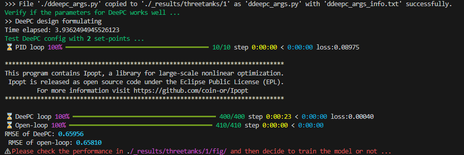

# Deep DeePC

This project is the source code of paper [**Deep DeePC: Data-enabled predictive control with low or no online optimization using deep learning**](https://arxiv.org/abs/2408.16338) by *X. Zhang, K. Zhang, Z. Li, and X. Yin*.

The objective of this work is to learn the DeePC operator using a neural network and bypass the online optimization of conventional DeePC for efficient online implementation.

> If you are using this work in your research or teaching, please include explicit acknowledge of this work and of our paper.
>
> Please check the sections of [**License**](#license) and [**Citation**](#citation) at the end.

---

## I. How to use

### 1. Install required packages:
```
    pip install -r path/to/requirements.txt
```
Note: if you want to use `GPU`, please install GPU version of `torch`, e.g.:
```
    pip install torch==1.8.0+cu101 torchvision==0.9.0+cu101 torchaudio===0.8.0 -f https://download.pytorch.org/whl/torch_stable.html
```

The source code can automatically run on a `CPU` or `GPU` without any modification.

- Specifically, two toolboxes are used which are developed by myself [`deepctools`](https://github.com/QiYuan-Zhang/DeePCtools) and [`QYtool`](https://github.com/QiYuan-Zhang/QYtool) for research purposes.

### 2. Run the project

- The arguments of DDeePC project is defined and modified in `ddeepc_args.py`, specify the arguments first.
- The training and testing part is in `main.py`.
  
#### a. To generate set-points for selected system:

```
    python main.py --system (selected systems) --gen_sp (number of set-points) --N (Time steps for one set-point)
```
For example:
```
    python main.py --system threetanks --gen_sp 10 --N 100
```

- Figure of generating set-points:


#### b. To train and test the model:
```
    python main.py --system (selected systems) --train --test_num (number of test runs) --N (Time steps for one set-point) --noise (#if add it, apply noise)
```
After training finished, it will automatically test the model.

For example:
```
    python main.py --system threetanks --train --test_num 1 --N 100 --noise
```

- The training process will automatically generate a new folder with a new trial number and save all related data and figures in this path: `./_results/system/new trial number`.

- First test the conventional DeePC performance based on current parameters.


- Next start the training process.


- After training, start the test process for Deep DeePC and constrained Deep DeePC.


#### c. To test the well-trained model:
```
    python main.py --system (selected systems) --test (model number) --test_num (number of test runs) --N (Time steps for one set-point) --noise (#if add it, apply noise)
```
For example, to test the well-trained model 3:
```
    python main.py --system threetanks --test 3 --test_num 10 --N 100 --noise
```
- The test part is identical to the part used in training and can be used for multiple evaluation trials.


## II. Organization of Deep DeePC source codes
```
. 
└── Deep DeePC 
    ├── README.md 
    ├── main.py
    ├── ddeepc_args.py
    ├── DDeePC 
    │   ├── __init__.py
    │   ├── model.py
    │   ├── Plants
    │   │   └── three_tanks.py
    │   ├── deepc.py
    │   ├── train.py
    │   ├── control.py
    │   ├── con_opt.py
    │   └── MyTool.py
    ├── _data
    │   ├── README_fig
    │   │   └── ...
    │   └── threetanks
    │       └── ...
    ├── _results
    │   └── threetanks
    │       └── ...
    ├── .gitignore
    ├── requirements.txt
    └── LICENSE
```

Additionally, two toolboxes are used which are developed by myself:

- [`deepctools`](https://github.com/QiYuan-Zhang/DeePCtools): A wrapped package for Data-enabled predictive control (DeePC) implementation. Including DeePC and Robust DeePC design with multiple objective functions.
- [`QYtool`](https://github.com/QiYuan-Zhang/QYtool): A wrapped useful tool package designed for research purposes, tailored specifically for my own research needs.


## III. Introductio to Deep DeePC


### 1. Training data construction


Figure from our paper [**Deep DeePC: Data-enabled predictive control with low or no online optimization using deep learning**](https://arxiv.org/abs/2408.16338). Please refer to the paper for more details.


### 2. Offline training 


Figure from our paper [**Deep DeePC: Data-enabled predictive control with low or no online optimization using deep learning**](https://arxiv.org/abs/2408.16338). Please refer to the paper for more details.

- Neural network: $\hat{g} = F_{\theta}(\mathbf{u}_{ini}, \mathbf{y}_{ini}, e_u, e_y | \theta)$ 

- Objective function: $J = \mathbb{E}_{\mathcal{D}} \Vert \mathbf{y}^r - \hat{\mathbf{y}} \Vert_Q^2 + \Vert \mathbf{u}^r - \hat{\mathbf{u}} \Vert_R^2 + \omega (\mathbf{u}, \mathbf{y})$ 


### 3. Constrainted Deep DeePC for online implementation


Figure from our paper [**Deep DeePC: Data-enabled predictive control with low or no online optimization using deep learning**](https://arxiv.org/abs/2408.16338). Please refer to the paper for more details.

- When predicted trajectories $\hat{\mathbf{u}}_k = U_f \hat{g}_k, \ \hat{\mathbf{y}}_k = Y_f \hat{g}_k$ violate constraints, solve the following optimization problem:

    $min_{g^*_k} \Vert g^*_k - \hat{g}_k \Vert_2^2$

    s.t. $\quad \mathbf{u}_{lb} \leq U_f g^*_k\leq \mathbf{u}_{ub}$

    $\mathbf{y}_{lb} \leq Y_f g^*_k \leq \mathbf{y}_{ub}$

- Then apply the new operator $g^*_k$ to obtain the optimal control action to the system.


## IV. Case study on chemical process


Figure from our paper [**Deep DeePC: Data-enabled predictive control with low or no online optimization using deep learning**](https://arxiv.org/abs/2408.16338). Please refer to the paper for more details.


## Acknowledgment

The sources code is established and contributed by `Xuewen Zhang`. This project is the source code of paper `X. Zhang, K. Zhang, Z. Li, and X. Yin. Deep DeePC: Data-enabled predictive control with low or no online optimization using deep learning. arXiv preprint arXiv:2408.16338, 2024`. 

## Citation

- If you are using this work in your research or teaching, please include explicit acknowledgment of this work and of our paper:
```
    @article{zhang2024deepdeepc,
    title={Deep DeePC: Data-enabled predictive control with low or no online optimization using deep learnin},
    author={Zhang, Xuewen and Zhang, Kaixiang and Li, Zhaojian and Yin, Xunyuan},
    journal={arXiv:2408.16338},
    year={2024}
    }
```

- The code also contains the [`deepctools`](https://github.com/QiYuan-Zhang/DeePCtools) toolbox for implementing DeePC, developed by `Xuewen Zhang`. Please be sure to explicitly acknowledge its use if you incorporate it into your work. This project and its license can be found in this [link](https://github.com/QiYuan-Zhang/DeePCtools).

- The code also contains the [`QYtool`](https://github.com/QiYuan-Zhang/QYtool) toolbox for research needs, developed by `Xuewen Zhang`. Please be sure to explicitly acknowledge its use if you incorporate it into your work. This project and its license can be found in this [link](https://github.com/QiYuan-Zhang/QYtool).


## License
The project is released under the APACHE license. See [LICENSE](https://github.com/QiYuan-Zhang/QYtool/blob/main/LICENSE) for details.

Copyright 2024 Xuewen Zhang (xuewen001@e.ntu.edu.sg)

Licensed under the Apache License, Version 2.0 (the "License"); you may not use this file except in compliance with the License. You may obtain a copy of the License at
```
    http://www.apache.org/licenses/LICENSE-2.0
```
Unless required by applicable law or agreed to in writing, software distributed under the License is distributed on an "AS IS" BASIS, WITHOUT WARRANTIES OR CONDITIONS OF ANY KIND, either express or implied. See the License for the specific language governing permissions and limitations under the License.

